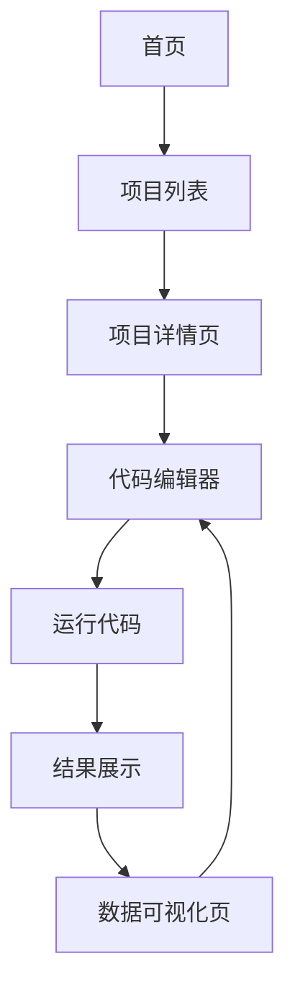

## 1. Product Overview
Python数据分析教学训练平台，提供10个递进式项目覆盖数据清洗、处理、分析、可视化及常见算法。
- 目标用户为学生和教师，帮助学生掌握pandas核心能力，教师可用于教学实践。
- 市场价值：填补Python数据分析教学资源缺口，提供系统化、实践导向的学习路径。

## 2. Core Features

### 2.1 User Roles
| Role | Registration Method | Core Permissions |
|------|---------------------|------------------|
| Student | 无需注册 | 访问所有项目、运行代码、查看结果 |
| Teacher | 无需注册 | 同学生权限，可查看教学指南 |

### 2.2 Feature Module
1. **首页**：项目列表、平台介绍、技术栈说明
2. **项目详情页**：项目描述、技术要点、代码编辑器、运行结果展示
3. **数据可视化页**：交互式图表展示、结果分析

### 2.3 Page Details
| Page Name | Module Name | Feature description |
|-----------|-------------|---------------------|
| 首页 | 项目列表 | 展示10个递进式项目，包含项目名称、简介、难度等级 |
| 首页 | 平台介绍 | 说明平台功能、使用方法、技术栈 |
| 项目详情页 | 项目描述 | 详细介绍项目背景、技术点、任务要求 |
| 项目详情页 | 代码编辑器 | 内置Python代码编辑器，支持运行代码、查看输出 |
| 项目详情页 | 数据生成 | 自动生成模拟数据，供学生分析使用 |
| 项目详情页 | 结果展示 | 展示代码运行结果、数据质量报告、可视化图表 |
| 数据可视化页 | 交互式图表 | 基于分析结果生成动态图表，支持交互操作 |

## 3. Core Process
用户流程：访问首页 → 选择项目 → 查看项目详情 → 运行示例代码 → 查看结果分析 → 尝试修改代码 → 重新运行验证

## 4. User Interface Design
### 4.1 Design Style
- 主色调：蓝色(#165DFF)和白色(#FFFFFF)，辅助色：浅灰(#F5F7FA)
- 按钮风格：圆角矩形，悬停效果
- 字体：无衬线字体，标题18-24px，正文14-16px
- 布局风格：卡片式布局，顶部导航，响应式设计
- 图标风格：扁平化图标，简洁现代

### 4.2 Page Design Overview
| Page Name | Module Name | UI Elements |
|-----------|-------------|-------------|
| 首页 | 项目列表 | 卡片式布局，每个项目卡片包含名称、简介、难度标签，悬停效果 |
| 项目详情页 | 代码编辑器 | 深色背景，语法高亮，运行按钮，输出区域 |
| 项目详情页 | 结果展示 | 表格展示数据，图表展示分析结果，响应式布局 |
| 数据可视化页 | 交互式图表 | 多种图表类型，支持缩放、筛选，动态更新 |

### 4.3 Responsiveness
- 桌面优先设计，适配平板和移动设备
- 移动端采用垂直布局，简化导航
- 触摸优化，确保在移动设备上操作流畅

### 4.4 3D Scene Guidance
- 不适用，本项目为数据可视化应用，无需3D场景