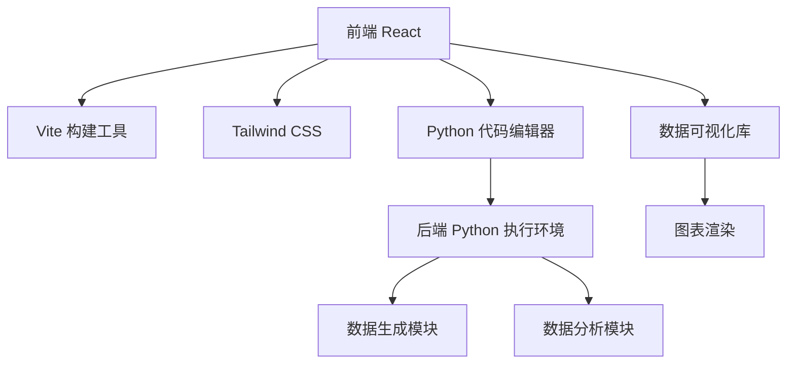
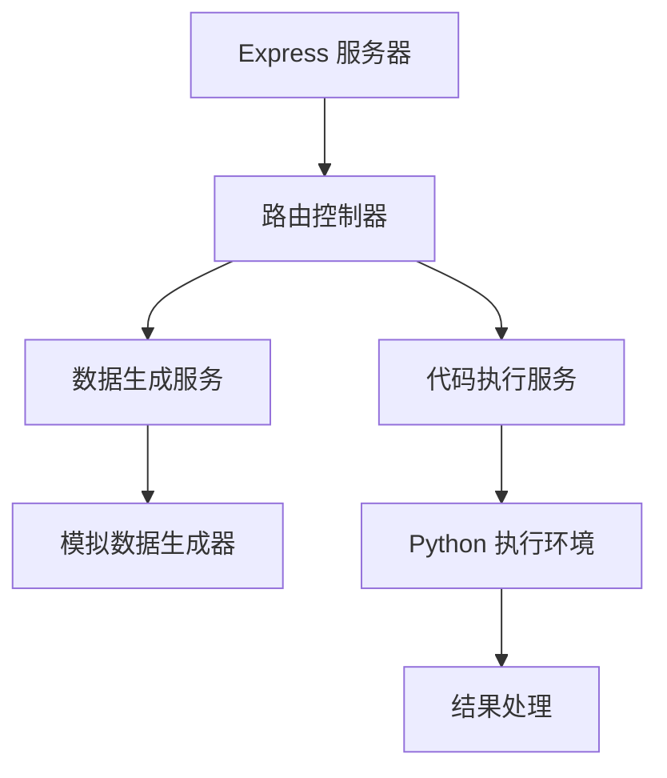

## 1. Architecture Design


## 2. Technology Description
- 前端：React@18 + Tailwind CSS@3 + Vite
- 初始化工具：vite-init
- 后端：Express@4 + Python 执行环境
- 数据库：内存存储（用于临时数据）
- 数据可视化：Chart.js / ECharts
- 代码编辑器：Monaco Editor
- Python 执行：Pyodide（浏览器中运行 Python）

## 3. Route Definitions
| Route | Purpose |
|-------|---------|
| / | 首页，展示项目列表 |
| /project/:id | 项目详情页，包含代码编辑器和结果展示 |
| /visualization/:id | 数据可视化页，展示交互式图表 |

## 4. API Definitions

### 4.1 数据生成 API
- **Endpoint**: `/api/data/generate`
- **Method**: POST
- **Request Body**:
  ```json
  {
    "projectId": "1",
    "params": {}
  }
  ```
- **Response**:
  ```json
  {
    "success": true,
    "data": {
      "rawData": [...],
      "cleanedData": [...]
    }
  }
  ```

### 4.2 代码执行 API
- **Endpoint**: `/api/code/execute`
- **Method**: POST
- **Request Body**:
  ```json
  {
    "code": "import pandas as pd; print('Hello World')",
    "data": [...]  // 可选，提供数据
  }
  ```
- **Response**:
  ```json
  {
    "success": true,
    "output": "Hello World",
    "error": null,
    "results": {...}  // 分析结果
  }
  ```

## 5. Server Architecture Diagram


## 6. Data Model

### 6.1 项目数据结构
```typescript
interface Project {
  id: string;
  title: string;
  description: string;
  difficulty: 'beginner' | 'intermediate' | 'advanced';
  technicalPoints: string[];
  tasks: string[];
  sampleCode: string;
  dataSchema: {
    columns: string[];
    types: string[];
  };
}
```

### 6.2 执行结果数据结构
```typescript
interface ExecutionResult {
  output: string;
  error: string | null;
  dataQualityReport?: {
    missingRate: number;
    anomalyCount: number;
    duplicateCount: number;
  };
  visualizations?: {
    type: string;
    data: any;
    options: any;
  }[];
  analysisResults?: any;
}
```

### 6.3 模拟数据生成
每个项目的模拟数据将通过前端或后端的生成器创建，确保数据包含所需的特征（如缺失值、异常值、重复记录等）。

## 7. 技术实现要点
- 使用 Pyodide 在浏览器中运行 Python 代码，避免服务器端 Python 执行的安全问题
- 前端状态管理使用 Zustand，确保代码执行状态和结果的实时更新
- 响应式设计确保在不同设备上的良好体验
- 模块化代码结构，便于维护和扩展
- 数据可视化使用 Chart.js 或 ECharts，提供丰富的图表类型

## 8. 性能优化策略
- 代码分割，减少初始加载时间
- 数据缓存，避免重复生成相同数据
- 懒加载非关键资源
- 优化 Python 代码执行，限制执行时间和内存使用
- 图表渲染优化，确保大数据集的流畅展示